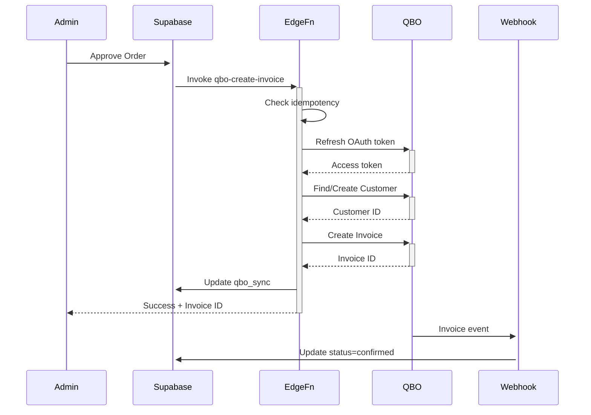

# QuickBooks Online Integration Documentation

## Architecture Overview

```
Admin Approve → Edge(qbo-create-invoice) → QBO Invoice (Qty↓) → qbo_sync → (Webhook confirm)
```

## Why Invoice Instead of Sales Receipt?

We use **Invoice** creation instead of SalesReceipt because:
1. **No payment received yet** - Orders are approved but payment happens offline
2. **Inventory decrements immediately** - QBO automatically reduces Qty-on-hand for Inventory Items when Invoice is posted
3. **Proper accounting flow** - Invoice represents a sale with pending payment (accounts receivable)

## Setup Instructions

### 1. Database Migration

Run the migration to create QBO integration tables:

```bash
supabase db push
```

This creates:
- `qb_items` - SKU to QBO Item ID mapping
- `orders` - Customer orders
- `order_items` - Order line items
- `qbo_sync` - Sync status tracking
- `integration_tokens` - OAuth token storage

### 2. QuickBooks App Configuration

1. Go to [QuickBooks Developer Portal](https://developer.intuit.com)
2. Create or select your app
3. Configure OAuth 2.0 settings:
   - Redirect URI: `https://your-app.com/qbo-callback`
   - Scopes: `com.intuit.quickbooks.accounting`

### 3. Environment Variables

Set these secrets in Supabase Dashboard:

```bash
supabase secrets set QBO_CLIENT_ID=your_client_id
supabase secrets set QBO_CLIENT_SECRET=your_client_secret  
supabase secrets set QBO_REALM_ID=your_realm_id
supabase secrets set QBO_ENV=sandbox # or 'production'
supabase secrets set QBO_WEBHOOK_VERIFIER_TOKEN=your_webhook_token
```

### 4. Deploy Edge Functions

```bash
# Deploy the invoice creation function
supabase functions deploy qbo-create-invoice

# Deploy the webhook handler
supabase functions deploy qbo-webhook
```

### 5. Configure Webhook in QBO

1. Go to your QBO app settings
2. Add webhook endpoint: `https://your-project.supabase.co/functions/v1/qbo-webhook`
3. Subscribe to Invoice events
4. Copy the verifier token to `QBO_WEBHOOK_VERIFIER_TOKEN`

### 6. Initial OAuth Authorization

You need to authorize the app once to get the initial refresh token:

1. Build OAuth URL:
```
https://appcenter.intuit.com/connect/oauth2?
  client_id=YOUR_CLIENT_ID&
  scope=com.intuit.quickbooks.accounting&
  redirect_uri=YOUR_REDIRECT_URI&
  response_type=code&
  state=security_token
```

2. After authorization, exchange code for tokens and save to `integration_tokens` table

### 7. Map SKUs to QBO Items

Insert mappings into `qb_items` table:

```sql
INSERT INTO qb_items (sku, qb_item_id, name) VALUES
  ('OLIVE-001', '1', 'Premium Olives'),
  ('FETA-001', '2', 'Greek Feta Cheese'),
  ('BAKLAVA-001', '3', 'Traditional Baklava');
```

## Usage

### Admin Workflow

1. Navigate to `/orders` in the admin panel
2. View pending orders with their items
3. Click "Approve & Sync" to:
   - Update order status to 'approved'
   - Create QBO Invoice
   - Decrement inventory in QBO
4. Monitor sync status (queued → sent → confirmed)
5. Use "Re-sync" if needed (idempotent)

### Testing

#### Local Testing

```bash
# Start Edge Function locally
supabase functions serve qbo-create-invoice

# Test with curl
curl -X POST http://localhost:54321/functions/v1/qbo-create-invoice \
  -H "Authorization: Bearer YOUR_ANON_KEY" \
  -H "Content-Type: application/json" \
  -d '{"order_id": "uuid-here"}'
```

#### Run Tests

```bash
cd supabase/functions/qbo-create-invoice
deno test --allow-env test.ts
```

## Monitoring & Troubleshooting

### Check Sync Status

```sql
SELECT o.id, o.status, o.customer_name, q.status as sync_status, q.qbo_txn_id, q.last_error
FROM orders o
LEFT JOIN qbo_sync q ON o.id = q.order_id
ORDER BY o.created_at DESC;
```

### Common Issues

1. **"No refresh token found"**
   - Need to complete initial OAuth flow
   - Check `integration_tokens` table

2. **"Order not approved"**
   - Order must have status='approved'
   - Update via admin panel first

3. **"SKU not mapped"**
   - Add missing SKU to `qb_items` table
   - Map to QBO Inventory Item ID

4. **Inventory goes negative**
   - QBO allows negative inventory by default
   - Configure QBO settings to prevent if needed

### Rollback During Testing

To delete a test invoice in QBO:
1. Log into QuickBooks Online
2. Go to Sales → Invoices
3. Find invoice by number/customer
4. Click More → Delete or Void

## Security Considerations

- All QBO operations use service role in Edge Functions
- No client-side API calls to QBO
- OAuth tokens stored server-side only
- Webhook signatures verified with HMAC-SHA256
- Idempotent operations prevent duplicates

## API Flow Diagram



## Support

For issues or questions:
1. Check Edge Function logs: `supabase functions logs qbo-create-invoice`
2. Review `qbo_sync.last_error` field
3. Verify QBO Item mappings in `qb_items`
4. Ensure OAuth tokens are current